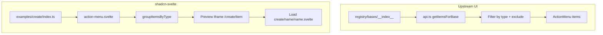

# Create Page Examples Parity Plan

## Summary of Upstream vs. Ours

**Upstream** (`[ui/apps/v4/app/(create)/lib/api.ts](/Users/ieedan/Documents/github/ui/apps/v4/app/(create)`/lib/api.ts)) shows items from the registry index, filtered by:

- `ALLOWED_ITEM_TYPES`: `registry:block`, `registry:example`
- `EXCLUDED_ITEMS`: `component-example`
- Names not matching `/\d+$/` (excludes `login-01`, `sidebar-01`, etc.)

**Result: 61 items** — 60 examples + 1 block (`preview`)

**Our project** uses a static list in `[docs/src/lib/registry/examples/create/index.ts](/Users/ieedan/Documents/github/shadcn-svelte/docs/src/lib/registry/examples/create/index.ts)`:

- 57 component examples + 5 blocks (home, elevenlabs, github, vercel, chatgpt)

---

## Gap Analysis

### Missing items (to add)

| Item        | Type             | Upstream Source                                 | Action             |
| ----------- | ---------------- | ----------------------------------------------- | ------------------ |
| **demo**    | registry:example | `registry/bases/radix/examples/demo.tsx`        | Create new example |
| **preview** | registry:block   | `registry/bases/radix/blocks/preview/index.tsx` | Create new block   |

### Existing items (57 examples)

All 57 component examples exist with the correct file structure (`{name}/{name}.svelte`). Each uses `ExampleWrapper` and sub-variants, mirroring the upstream pattern. Style verification is required per example (focus on classes, layout, variants — not logic).

---

## Implementation Tasks

### Phase 1: Add Missing "demo" Example

**What upstream demo contains:**

- Style Overview: Card with color swatch grid (`--background`, `--foreground`, `--primary`, etc.)
- UI Elements: Grid of icon placeholders in ring-bordered cards
- Composite form: Buttons, Item (2FA), Slider, InputGroup, Textarea, Badges, RadioGroup, Checkbox, AlertDialog, ButtonGroup + DropdownMenu, Switch

**Files to create:**

- `docs/src/lib/registry/examples/create/demo/demo.svelte`

**Index update:**

- Add `{ title: "Demo", name: "demo", type: "registry:example" }` to `[index.ts](/Users/ieedan/Documents/github/shadcn-svelte/docs/src/lib/registry/examples/create/index.ts)`, placed with other examples (e.g., before blocks).

**Reference:** `[ui/apps/v4/registry/bases/radix/examples/demo.tsx](/Users/ieedan/Documents/github/ui/apps/v4/registry/bases/radix/examples/demo.tsx)`

---

### Phase 2: Add Missing "preview" Block

**What upstream preview contains:**

- Large horizontal grid of design cards: StyleOverview, UIElements, CodespacesCard, BarVisualizerCard, ObservabilityCard, Invoice, Contributors, etc.
- Uses `contain-[paint]`, `[--gap:--spacing(4)]`, responsive grid columns

**Approach:** Compose a Svelte `preview/preview.svelte` that imports and renders our existing card components (ObservabilityCard, CodespacesCard from github, BarVisualizer from elevenlabs, etc.) in a grid matching upstream layout.

**Files to create:**

- `docs/src/lib/registry/examples/create/preview/preview.svelte`

**Index update:**

- Add `{ title: "Preview", name: "preview", type: "registry:block" }` to `[index.ts](/Users/ieedan/Documents/github/shadcn-svelte/docs/src/lib/registry/examples/create/index.ts)`.

**Reference:** `[ui/apps/v4/registry/bases/radix/blocks/preview/index.tsx](/Users/ieedan/Documents/github/ui/apps/v4/registry/bases/radix/blocks/preview/index.tsx)`

---

### Phase 3: Style Verification (57 Examples)

For each component example, compare:

- Layout classes (`flex`, `grid`, `gap`, `max-w-`\*, etc.)
- Variant usage (e.g., button variants, badge variants)
- Spacing and typography
- Example structure (ExampleWrapper, sub-example composition)

**Verification approach:**

- Use upstream `registry/bases/radix/examples/*-example.tsx` as reference
- Diff key class strings and structure
- Fix style mismatches only (ignore logic/props per user request)

**Priority order:** Start with examples that have more complex layouts (dialog, dropdown-menu, field, input-group, etc.) and high-visibility components (button, card, badge).

---

## Data Flow (Reference)

---

## File Structure Summary

| Path                                                                   | Purpose                               |
| ---------------------------------------------------------------------- | ------------------------------------- |
| `docs/src/lib/registry/examples/create/index.ts`                       | Add `demo`, `preview` entries         |
| `docs/src/lib/registry/examples/create/demo/demo.svelte`               | New – style overview + form composite |
| `docs/src/lib/registry/examples/create/preview/preview.svelte`         | New – grid of design cards            |
| `docs/src/lib/registry/examples/create/{component}/{component}.svelte` | Verify styles (57 files)              |
