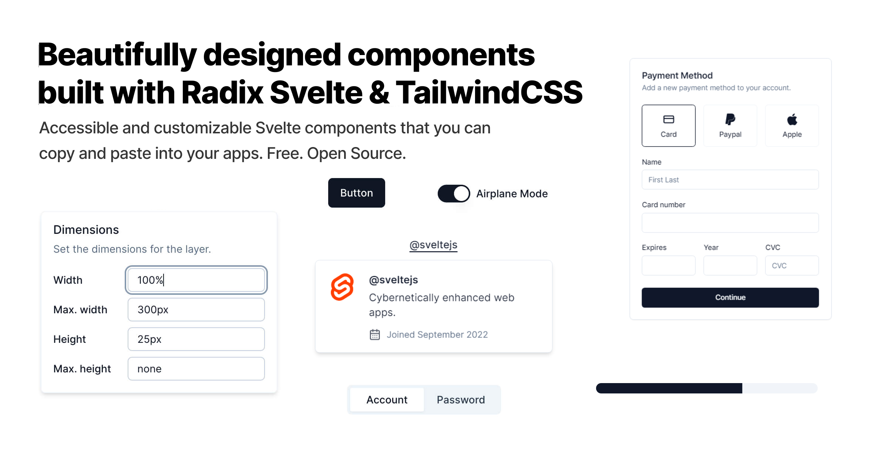

 
 <h1 align="center">
  shadcn-svelte
 </h1>

[shadcn-svelte](https://www.shadcn-svelte.com/) is an unofficial community-led [Svelte](https://svelte.dev) port of [shadcn/ui](https://ui.shadcn.com/).

> **Note**   **We are not affiliated with shadcn, but we did get his blessing prior to creating this project**   This is a project born out of the need for a similar project for the Svelte ecosystem.

Accessible and customizable components that you can copy and paste into your apps. Free. Open Source. **Use this to build your own component library**.

## Documentation

Visit https://shadcn-svelte.com/docs to view the documentation.

## License

Licensed under the [MIT license](https://github.com/shadcn/ui/blob/main/LICENSE.md).
