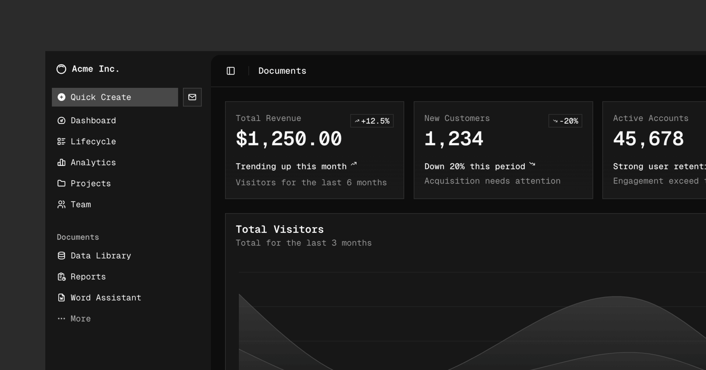

 
 <h1 align="center">
  shadcn-svelte
 </h1>

[shadcn-svelte](https://www.shadcn-svelte.com/) is an unofficial community-led [Svelte](https://svelte.dev) port of [shadcn/ui](https://ui.shadcn.com/).

> **Note**   **We are not affiliated with shadcn, but we did get his blessing prior to creating this project**   This is a project born out of the need for a similar project for the Svelte ecosystem.

Accessible and customizable components that you can copy and paste into your apps. Free. Open Source. **Use this to build your own component library**.

## Documentation

Visit https://shadcn-svelte.com/docs to view the documentation.

## Sponsors

This project is supported by the following beautiful people/organizations:

  

## License

<!-- automd:contributors license=MIT author="huntabyte" -->

Published under the [MIT](https://github.com/huntabyte/shadcn-svelte/blob/main/LICENSE.md) license.
Built by [@huntabyte](https://github.com/huntabyte), [CokaKoala](https://github.com/adriangonz97),and [community](https://github.com/huntabyte/shadcn-svelte/graphs/contributors) 💛
  

<!-- /automd -->

## Community

Join the Discord server to ask questions, find collaborators, or just say hi!

<a href="https://discord.gg/fdXy3Sk8Gq" alt="Svecosystem Discord community">
<picture>
  <source media="(prefers-color-scheme: dark)" srcset="https://invidget.switchblade.xyz/fdXy3Sk8Gq">
  
</picture>
</a>
